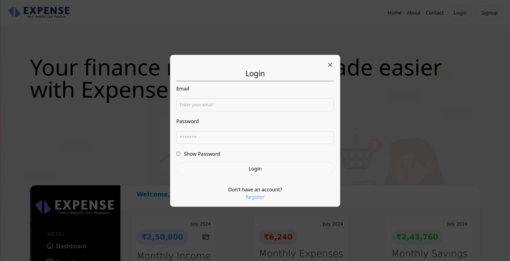
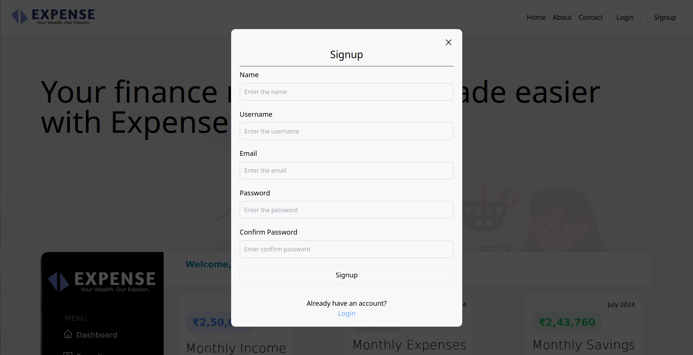
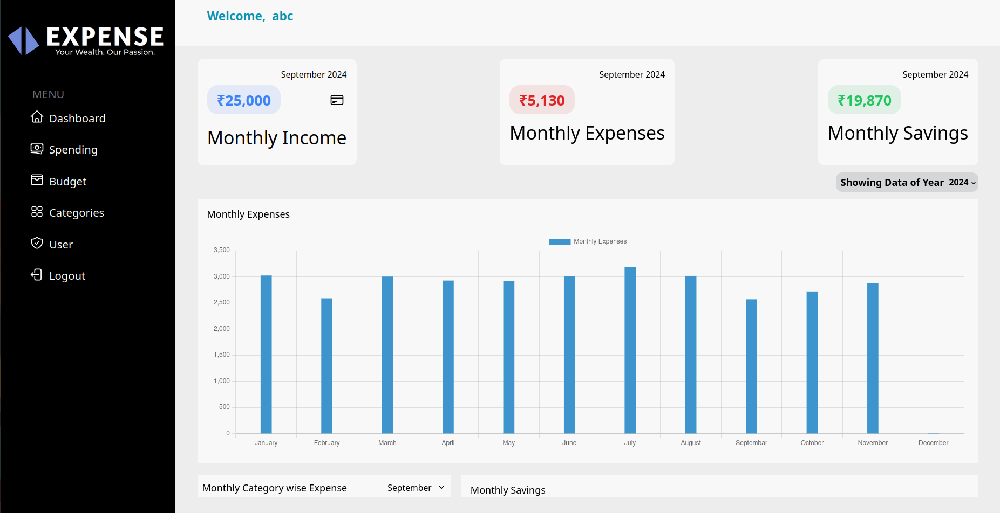
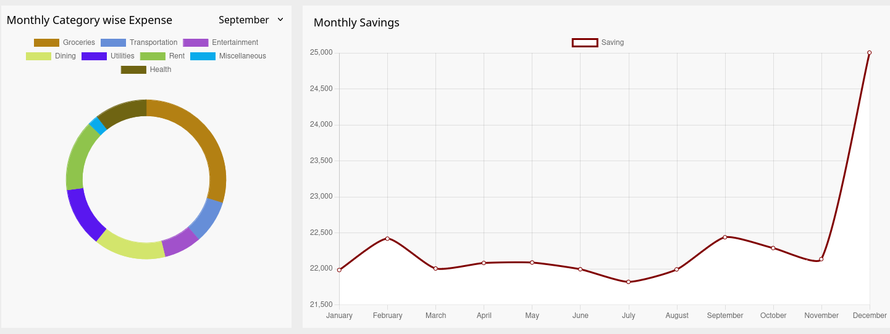
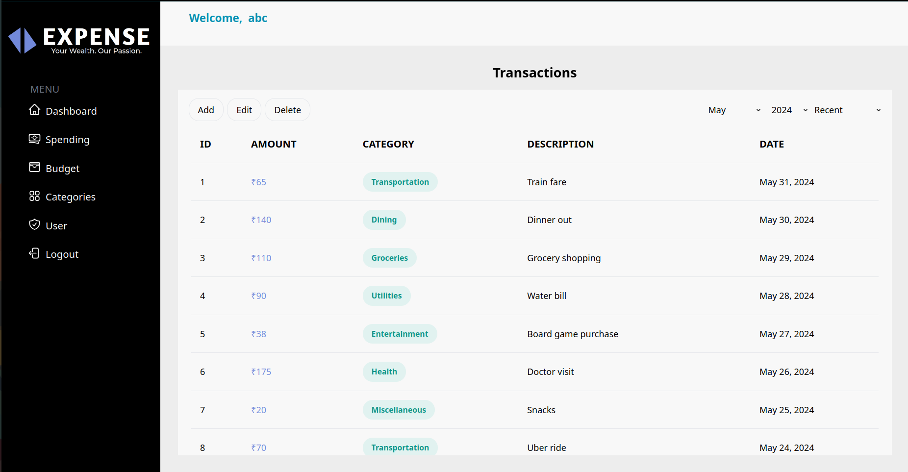
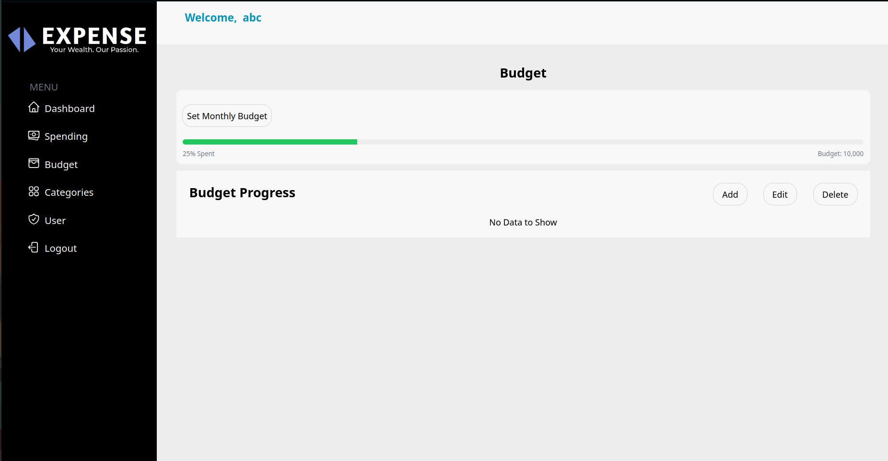
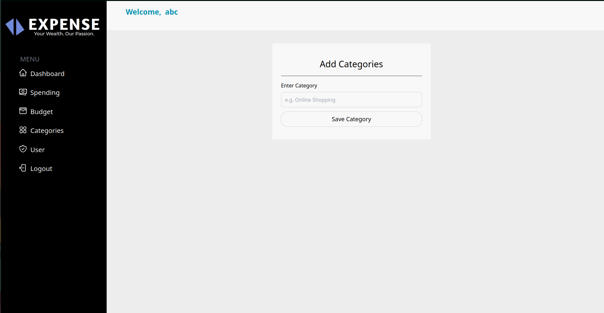
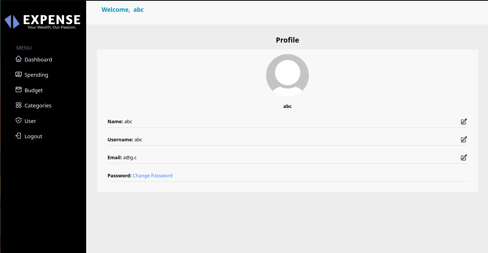

# Personal Expense Tracker

A comprehensive application for tracking personal expenses, managing budgets, and analyzing spending habits.

## Table of Contents
- [Features](#features)
- [Screenshots](#screenshots)
- [Technologies Used](#technologies-used)
- [Getting Started](#getting-started)
- [Usage](#usage)
- [Contributing](#contributing)
- [License](#license)

## Features
- User authentication (Login and Signup)
- Dashboard with financial overview
- Detailed spending tracker with sorting and filtering options
- Monthly budget setting and management
- Custom expense categories
- User profile management

## Screenshots

### Login

*Secure login interface for existing users*

### Signup

*User-friendly signup process for new account creation*

### Dashboard


*Comprehensive overview of financial status and recent transactions*

### Spending Tracker

*Detailed view of expenses with sorting and filtering options*

### Budget Management

*Set and track monthly budgets, including rollover from previous months*

### Categories

*Customize and manage expense categories*

### User Profile

*View and edit user details and preferences*

## Technologies Used
- **Backend:** Node.js, Express.js
- **Database:** PostgreSQL
- **Frontend:** React.js
- **Containerization:** Docker

## Getting Started

### Prerequisites
- Node.js and npm installed
- PostgreSQL installed and running
- Docker (optional, for containerization)

### Installation

1. Clone the repository:
   ```bash
   git clone https://github.com/Niket-10/Expense.git
   ```

2. Navigate to the project directory:
   ```bash
   cd Expense
   ```

3. Install dependencies:
   ```bash
   npm install
   ```

### Database Setup

1. Create a PostgreSQL database:
   ```sql
   CREATE DATABASE expense_tracker;
   ```

2. Run the provided SQL scripts to set up the necessary tables and seed data.

## Usage

1. Start the application:
   ```bash
   npm start
   ```

2. Access the application in your browser at http://localhost:3000

3. Sign up for a new account or log in with existing credentials

4. Use the dashboard to get an overview of your finances

5. Add expenses, set budgets, and manage categories as needed

6. Generate reports to analyze your spending habits

## Contributing

Contributions are welcome! Please feel free to submit a Pull Request.

## License

This project is licensed under the MIT License - see the [LICENSE](LICENSE) file for details.